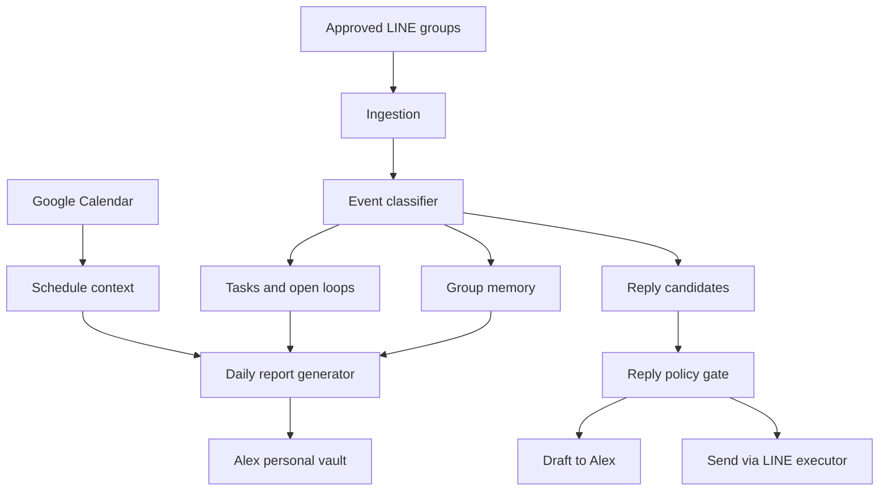

# Architecture

## High-Level Flow



## Components

| Component | Responsibility |
|---|---|
| Ingestion | Capture messages/events from approved LINE groups |
| Event classifier | Convert raw chat into mentions, tasks, decisions, social signals |
| Memory writer | Append structured notes to Alex's personal vault |
| Calendar context | Read free/busy and upcoming events |
| Reply drafter | Produce Alex-style replies with rationale |
| Policy gate | Decide draft-only, ask-confirmation, or auto-send |
| LINE executor | Send via approved LINE route and write delivery audit |
| Scheduler | Run morning/midday/night routines |

## Storage Model

Vault-first, append-only in V1:

```text
Alex Personal Vault/
  daily/
    YYYY-MM-DD.md
  line-groups/
    <group-slug>.md
  people/
    <person-name>.md
  tasks/
    open-loops.md
  logs/
    line-send-audit/YYYY-MM-DD.jsonl
```

Structured database can be added later after the note schema stabilizes.

