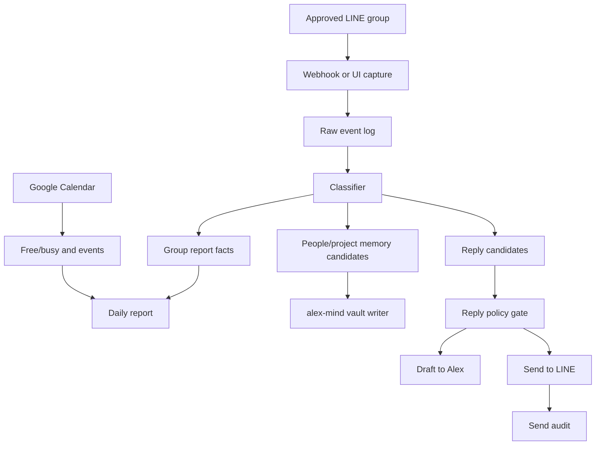

# Three-Cycle Plan

This document captures the three planning passes for Alex Clone Project. The
goal is to build a trusted Alex 分身 that can observe approved LINE groups,
report back to Alex, update the `alex-mind` Obsidian vault, understand Google
Calendar context, and help draft or send replies under clear rules.

## Research Baseline

### LINE

Official LINE constraints shape the first implementation:

- A LINE Official Account can be invited into group chats if `Allow bot to join
  group chats` is enabled in the LINE Developers Console.
- Only one LINE Official Account can be in a group or multi-person chat at a
  time.
- Webhook message events from groups include a `source.groupId`; that group ID
  is the stable target for group-specific memory and push messages.
- Push messages can target users, group chats, and multi-person chats. Messages
  sent to a group are visible to all members.
- Narrowcast/multicast are not the right tools for group delivery.

Sources:

- LINE group chats: <https://developers.line.biz/en/docs/messaging-api/group-chats>
- LINE sending messages: <https://developers.line.biz/en/docs/messaging-api/sending-messages/>

### Google Calendar

Calendar should be read-first in V1:

- `events.list` can read calendar events.
- `freeBusy.query` can answer whether calendars are busy over a time range.
- `events.insert` creates events but requires authorization and must stay
  confirmation-gated until Alex approves a calendar-write policy.

Sources:

- Events list: <https://developers.google.com/workspace/calendar/api/v3/reference/events/list>
- FreeBusy query: <https://developers.google.com/workspace/calendar/api/v3/reference/freebusy/query>
- Events insert: <https://developers.google.com/workspace/calendar/api/v3/reference/events/insert>

### Obsidian / alex-mind

`alex-mind` is the canonical vault. Obsidian stores notes as Markdown plain text
files inside a local vault folder, so Alex Clone can use filesystem writes, but
it must follow the vault's existing rules:

- write append-first,
- do not overwrite area files,
- preserve raw captures,
- mark uncertain facts as `[unverified]`,
- route low-confidence extraction to triage.

Local vault path:

```text
/Users/alex/Documents/Alex-Clone/Alex-Mind
```

Sources:

- Obsidian data storage: <https://help.obsidian.md/data-storage>
- Obsidian internal links: <https://obsidian.md/help/links>

## Cycle 1: Product And Scope

### Mission

Alex Clone is not a generic chatbot. It is Alex's authorized operating layer for
group intelligence:

- listen in selected LINE groups,
- extract what matters,
- report daily by group,
- keep relationship and project memory in `alex-mind`,
- check calendar context before suggesting commitments,
- draft replies in Alex's style,
- send only when the action is command-approved or policy-approved.

### Working Roles

| Role | What It Does |
|---|---|
| Observer | Watches approved groups and records notable updates |
| Reporter | Creates morning, midday, and night reports |
| Librarian | Writes structured memory into `alex-mind` |
| Scheduler | Reads Google Calendar and flags conflicts |
| Reply Copilot | Drafts replies in Alex's voice with context |
| Executor | Sends approved LINE replies and logs proof |

### First-Round Boundaries

- The clone operates only in groups Alex adds or explicitly approves.
- New groups start as `observe_and_report`.
- Replies start draft-only unless a group policy says otherwise.
- Calendar writes always require confirmation in V1.
- Sensitive or emotional replies require draft review.
- No secrets go into GitHub or vault notes.

## Cycle 2: Technical Architecture

### Access Paths

Alex Clone needs more than one LINE path because LINE access varies by group:

| Path | Use Case | Strength | Limitation |
|---|---|---|---|
| LINE Official Account webhook | Groups where the clone OA can be invited | Clean IDs, reliable webhooks, API sending | Only one OA per group; must be invited |
| Computer Use / Alex LINE desktop | Groups where OA cannot join or Alex wants account-context operation | Works with existing logged-in LINE UI | Needs Mac permissions, screenshots, fragile UI |
| Manual/export fallback | Historical context or one-off group data | Low risk, easy import | Not real-time |

### Data Flow



### Vault Write Pattern

V1 should write to `alex-mind` in three layers:

```text
raw/inbox/line/YYYY-MM-DD/<group-slug>.jsonl
wiki/syntheses/interactions-rolling/YYYY-MM-DD-line-digest.md
wiki/entities/people/<person>.md
```

Rules:

- Raw messages are source evidence and should not be rewritten.
- Daily digests are append-only and can link to group/person/project notes.
- Person and project notes get dated entries, not destructive rewrites.
- If confidence is below 0.7, write to triage instead of treating it as fact.

### Policy Gate

Outgoing LINE actions pass through a policy gate:

| Decision | Example |
|---|---|
| `draft_only` | "Reply warmly to this sensitive message" |
| `ask_confirm` | "Tell them I can meet Friday at 3" |
| `auto_send_allowed` | "Send the usual meeting reminder to approved group" |
| `blocked` | Missing group approval, money/time commitment, or unclear identity |

## Cycle 3: V1 Roadmap And Decisions

### Milestones

1. Repo and docs foundation  
   Lock the scope, vault path, operating policy, and build sequence.

2. Read-only group reporting  
   Capture group messages from an approved source and produce daily reports
   without sending replies.

3. Vault writer  
   Write raw LINE captures and daily digest notes into `alex-mind` using the
   vault's existing structure.

4. Calendar reader  
   Add Google Calendar read/freebusy context so the clone can answer scheduling
   questions and warn about conflicts.

5. Reply drafting  
   Generate Alex-style replies with a reason, risk level, and recommended send
   target.

6. Confirmed LINE sending  
   Send only after Alex confirms, then log timestamp, group, message hash, and
   screenshot/proof where possible.

7. Controlled auto-send  
   Add allowlisted low-risk patterns after the draft-and-confirm loop is stable.

### Core Decisions

- `alex-mind` is the canonical memory vault.
- V1 is append-first; no destructive vault edits.
- LINE OA webhook is preferred when available.
- Computer Use is a fallback for UI-only or already-logged-in contexts.
- Calendar read is allowed earlier than calendar write.
- Calendar write and high-risk LINE send require explicit confirmation.
- Every send and vault write needs an audit trail.

### Main Risks

| Risk | Mitigation |
|---|---|
| LINE group cannot accept clone OA | Use Computer Use or manual export fallback |
| Group identity ambiguity | Require group allowlist and source IDs |
| Accidental impersonation | Keep transparent labels for test mode and strict send policy |
| Vault memory pollution | Use raw evidence, confidence scores, and triage |
| Calendar privacy | Use least-privilege scopes and confirmation for writes |
| UI automation drift | Screenshot checks, selector fallback, and audit logs |

### V1 Definition Of Done

V1 is successful when Alex can say:

> 分身，今晚整理 AI 群跟 BNI 群，更新 alex-mind，幫我草擬需要回覆的人。

And the system will:

1. read approved group sources,
2. produce a concise per-group report,
3. update `alex-mind` with dated notes,
4. check calendar where relevant,
5. draft replies,
6. wait for Alex before sending anything not allowlisted.
